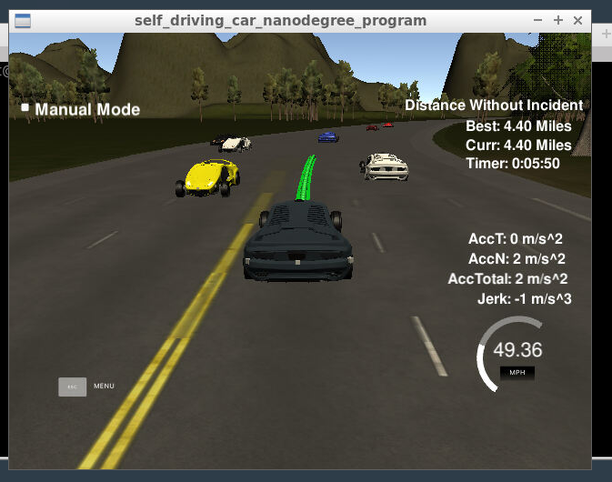

# CarND-Path-Planning-Project
Self-Driving Car Engineer Nanodegree Program
   
### Simulator.
You can download the Term3 Simulator which contains the Path Planning Project from the [releases tab (https://github.com/udacity/self-driving-car-sim/releases/tag/T3_v1.2).  

To run the simulator on Mac/Linux, first make the binary file executable with the following command:
```shell
sudo chmod u+x {simulator_file_name}
```

### Goals
In this project your goal is to safely navigate around a virtual highway with other traffic that is driving +-10 MPH of the 50 MPH speed limit. You will be provided the car's localization and sensor fusion data, there is also a sparse map list of waypoints around the highway. The car should try to go as close as possible to the 50 MPH speed limit, which means passing slower traffic when possible, note that other cars will try to change lanes too. The car should avoid hitting other cars at all cost as well as driving inside of the marked road lanes at all times, unless going from one lane to another. The car should be able to make one complete loop around the 6946m highway. Since the car is trying to go 50 MPH, it should take a little over 5 minutes to complete 1 loop. Also the car should not experience total acceleration over 10 m/s^2 and jerk that is greater than 10 m/s^3.

#### The map of the highway is in data/highway_map.txt
Each waypoint in the list contains  [x,y,s,dx,dy] values. x and y are the waypoint's map coordinate position, the s value is the distance along the road to get to that waypoint in meters, the dx and dy values define the unit normal vector pointing outward of the highway loop.

The highway's waypoints loop around so the frenet s value, distance along the road, goes from 0 to 6945.554.

## [Rubic](https://review.udacity.com/#!/rubrics/1020/view) points
### Code compilation
- [x] The code compiles correctly
No changes were made in the cmake configuration. A new file was added src/spline.h. It is the Cubic Spline interpolation implementation: a single .h file you can use splines instead of polynomials. It was a great suggestion from the classroom QA video.  

### Valid trajectories  
- [x] I ran the simulator for more than 15 miles without incidents:
  

**Note:** *I encountered some buggy situations. When my car was driving on the left or right lane and another car changed its lane to the center right next to my car the simulator detected a collision, but there were still some space between both cars. It seems like the hit boxes in those situation were too big. I tried some workarounds in my algorthim, like moving away some centimeters from the lane center whenever another car is next to me but this did not work out at all.*

### The car drives according to the speed limit
No red speed limit error message was shown.

### Max Acceleration and Jerk are not Exceeded
No red max jerk error message was shown.

### Car does not have collisions
No collisions. See the note above for some more information about collisions while testing.

### The car stays in its lane, except for the time between changing lanes
The car stays at the lane center most of the time. It only leaves the lane center when it has to change lanes, because of traffic and for collision avoidance.

### The car is able to change lanes
The car change lanes when the there is a slow car in front of it, and it is safe to change lanes, as no cars are nearby or when it is safe to return the center lane.
The lane change is also very smooth and it matches the rubic for max acceleration and jerk.

## My project code
My code consist of three parts:

#### Prediction 
Line 263 to line 320

This code block deals with the sensor fusion data and telemetry from the car to reason about the environment around. There are three main problems to solve:
- Is there a car in front of us
- Is there a car to the right
- Is there a car to the left 

The first point is important as we don't want to collide with cars in front of us. So whenever a car is right before us we have to slow down or change our lane.
For changing the lane the next two points come into play. We have to check if there is a car next to us to decide if a lane change is safe or not.

All those questions are answered by calculating the lane of each other car and their positions at the end of the last planned trajectory. Whenever another car is less than 30 meters in front or behind of us it will apear onto our "not safe" radar.

#### Behavior 
Line 321 to line 366

In this part of the code it is time to make some decisions:
- If there is a car in front of us, will we change the lane?
- Do we have to speed up or slow down?

Based on our predictions this code updates the speeed or makes a lane change when it is safe. Instead of increasing or decreasing the speed to a target value, which might end up with high jerk/acceleration, a *speed_diff* is used for speed changes. This solution makes the car more flexible and acting faster to changing situations.

#### Trajectory 
Line 367 to line 478

This last code block calculates the trajectory of our car based on the speed and lane output from the behavior block. It also uses the car coordinates and the last two path points as input to generate a smooth trajectory. This is required to get low jerk, which is required in the project rubics. For the genertation of the trajectory i used a spline function which was meantioned in the project FAQ (Thanks for the hint!). To make everything less complicated the coordinates are transformed to local car coordinates. Also the speed changes updates every trajectory point on its own and not the complete trajectory, this results in a very smooth trajectory even if the car has to speed up or slow down very quickly.

## Basic Build Instructions

1. Clone this repo.
2. Make a build directory: `mkdir build && cd build`
3. Compile: `cmake .. && make`
4. Run it: `./path_planning`.

## Dependencies

* cmake >= 3.5
  * All OSes: [click here for installation instructions](https://cmake.org/install/)
* make >= 4.1
  * Linux: make is installed by default on most Linux distros
  * Mac: [install Xcode command line tools to get make](https://developer.apple.com/xcode/features/)
  * Windows: [Click here for installation instructions](http://gnuwin32.sourceforge.net/packages/make.htm)
* gcc/g++ >= 5.4
  * Linux: gcc / g++ is installed by default on most Linux distros
  * Mac: same deal as make - [install Xcode command line tools]((https://developer.apple.com/xcode/features/)
  * Windows: recommend using [MinGW](http://www.mingw.org/)
* [uWebSockets](https://github.com/uWebSockets/uWebSockets)
  * Run either `install-mac.sh` or `install-ubuntu.sh`.
  * If you install from source, checkout to commit `e94b6e1`, i.e.
    ```
    git clone https://github.com/uWebSockets/uWebSockets 
    cd uWebSockets
    git checkout e94b6e1
    ```
